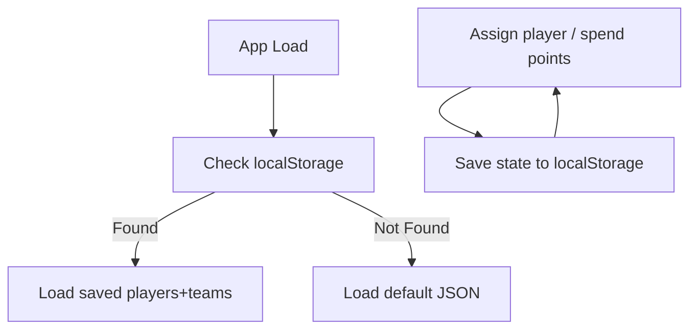

Here’s the plan:

---

## 🎯 Minimal Local Auction Dashboard

* **Tech**: React + Tailwind (for clean UI) + Local JSON state (no DB).
* Runs via `npm start`, no deployment.
* All data is saved in memory → reset when you restart (or you can add JSON export/import if you want persistence).

---

## 📊 Features

1. **Players Page**

   * Show all players with:

     * Name, Graduation Year, Position (GK/DEF/MID/ATT), Played Departmental? (Y/N).
   * Filter buttons for categories (GK/DEF/MID/ATT).
   * Status → Unsold / Sold (and to which team).

2. **Auction Action**

   * Click player → Assign to team, enter price.
   * Updates team’s budget & transaction log.

3. **Teams Page**

   * Card per team with:

     * Players bought (with price + position).
     * Total spent.
     * Budget left.
     * Transaction history.

4. **Undo/Edit**

   * Remove player from team if you make a mistake.

---

## 🔄 Workflow

* Start app → load all players + teams (hardcoded JSON file).
* Run auction:

  * Announce player on GMeet.
  * After bidding → click player → assign to team → enter price.
* App updates instantly.

---

## 🗂️ Data Structures (local JSON)

```js
// players.js
[
  { id: 1, name: "Player A", year: "2023", position: "GK", prevTournament: true, soldTo: null, price: 0 },
  { id: 2, name: "Player B", year: "2022", position: "MID", prevTournament: false, soldTo: null, price: 0 }
]

// teams.js
[
  { id: 1, name: "Team Red", budget: 1000, spent: 0, players: [] },
  { id: 2, name: "Team Blue", budget: 1000, spent: 0, players: [] }
]
```

---

## 🚀 Build Steps

1. Create React app (`npx create-vite@latest auction-app --template react`).
2. Add Tailwind (`npm install -D tailwindcss postcss autoprefixer && npx tailwindcss init`).
3. Create components:

   * `PlayerList.jsx` → list & filter players.
   * `TeamDashboard.jsx` → show teams, players, budgets.
   * `AuctionControl.jsx` → form to assign player → team.
4. Manage state in `App.jsx` using `useState` with `players` + `teams`.

---

Since we'll only run it locally, the **simplest way is to use `localStorage`** (no DB needed). That way:

* Player/team data lives in memory (`useState`).
* On every update → save to `localStorage`.
* On app load → check `localStorage` and restore state.

This gives you **auto persistence** without extra setup.

---

## 🔄 Persistence Flow



---

## 🗂️ Example Data

```js
// defaultPlayers.js
[
  { id: 1, name: "Player A", year: "2023", position: "GK", prevTournament: true, soldTo: null, price: 0 },
  { id: 2, name: "Player B", year: "2022", position: "MID", prevTournament: false, soldTo: null, price: 0 }
]

// defaultTeams.js
[
  { id: 1, name: "Team Red", budget: 1000, spent: 0, players: [] },
  { id: 2, name: "Team Blue", budget: 1000, spent: 0, players: [] }
]
```

---

## ⚡ React Hook for Persistence

```js
function usePersistentState(key, defaultValue) {
  const [state, setState] = React.useState(() => {
    const saved = localStorage.getItem(key);
    return saved ? JSON.parse(saved) : defaultValue;
  });

  React.useEffect(() => {
    localStorage.setItem(key, JSON.stringify(state));
  }, [key, state]);

  return [state, setState];
}
```

You’ll use it like this:

```js
const [players, setPlayers] = usePersistentState("players", defaultPlayers);
const [teams, setTeams] = usePersistentState("teams", defaultTeams);
```

Now your data **auto-saves** every time you update it, and comes back after refresh.

---

